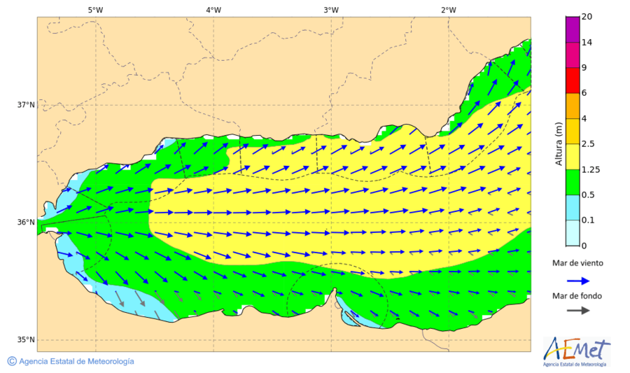

# AEMET Yellow Watch

## Introduction

AEMET Yellow Watch is a project that monitors and analyzes swell data along the
Andalusian coast, particularly around Málaga.  It combines weather forecast
image analysis from AEMET with live webcam footage to track potential swell
conditions and provide real-time notifications. The goal is to create an automated, 
scalable system that helps forecast ocean swells based on visual data. This
project will evolve to include more data sources and improved prediction
accuracy.



## Project Structure

The project is divided into four key components:

- **AEMET Forecast Image Analysis**: This component tracks swell forecasts by analyzing yellow warning areas on AEMET's maritime prediction maps.
- **Webcam Capture Service**: A script that captures hourly snapshots from local webcams, processes frames, and uploads them for analysis.
- **Web Frontend**: Displays the swell data and alert history on a simple webpage using FastHTML.
- **Worker and Image Processing**: Detects swells using computer vision techniques on both AEMET images and webcam footage, identifying significant swell events and generating alerts.

## Setup

Each component is containerized with Docker and can be deployed independently. The setup runs on Python 3.12 and is deployed using Google Cloud Run for scalability.

### Tech Stack

- **Python**: Core scripting language.
- **OpenCV**: Used for image processing and contour detection.
- **Google Cloud Storage**: Stores processed frames and swell data.
- **FastHTML**: Renders the frontend for displaying detected swell events.
- **Streamlink**: For capturing live video streams from webcams.
- **BeautifulSoup & Requests**: For web scraping AEMET's forecast images.

## Installation

To get started, clone this repository and follow the instructions for each component:

1. **AEMET Forecast Image Analysis**
    ```bash
    cd worker/
    docker build -t aemet-forecast .
    docker run --rm aemet-forecast
    ```

2. **Webcam Capture**
    ```bash
    cd cam-watch/
    docker build -t webcam-capture .
    docker run --rm webcam-capture
    ```

3. **Web Frontend**
    ```bash
    cd web/
    docker build -t swell-watch-web .
    docker run -d 8080:8080 swell-watch-web
    ```

## How It Works

1. **Image Analysis**: The `worker.py` script scrapes forecast images from AEMET and detects yellow swell warning areas using HSV color thresholding and contour detection.
   
2. **Webcam Capture**: The `cam-watch/main.py` script captures frames from local webcams and processes them using OpenCV. It then uploads the results to a Google Cloud Storage bucket for further analysis.

3. **Swell Alerts**: Detected swells are stored in a JSON file, uploaded to the cloud, and displayed on the web interface.


## How to Use

Once the Docker containers are running, access the web interface at [localhost:8080](http://localhost:8080) to view the latest detected swell events. The backend services will run in the background, automatically fetching and processing new data every hour.
